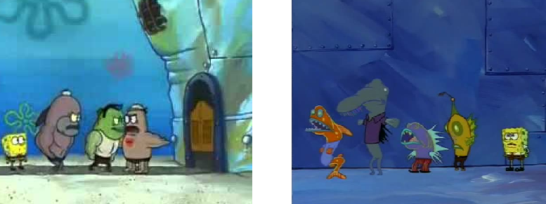

#

由於全球暖化的關係，兩個不同時間線的海綿寶寶連接上了。  

嗯？？？  



一個時間線的海綿寶寶正在排隊參加猛男俱樂部，一個時間線的海綿寶寶正在排隊等公車。  
每條魚依照其所在隊伍中的順序由小到大依次編號。兩隊伍魚數量相同。

海綿寶寶發現，第一個時間線的猛男魚們與第二個時間線的怪魚們個個都是戰力非凡，  
喜歡近距離觀賞決鬥的海綿寶寶固然好奇：如果這些魚打起來能有多精彩。  

每條魚都有自己的戰鬥力，兩條魚的戰鬥力差就是這兩條魚決鬥的精采度。  
兩群魚決鬥時（兩群魚數量必相同），各會依次派出一條魚決鬥，直到每條魚都決鬥過。  
兩條魚決鬥完就會休息（換句話說每條魚恰好會進行一場決鬥）。  
猛男魚群會先派出編號小的的魚；怪魚群會先派出編號大的魚。  
而兩群魚決鬥的精采度，就是各場決鬥精采度的總和。   

海綿寶寶會多次從猛男魚和怪魚兩隊伍中挑出編號 $l_i$ 到 $r_i$ 的兩群進行假想決鬥，  
請你對於每一次的假想決鬥，告訴海綿寶寶兩群魚決鬥的精采度。  

\clearpage

## 輸入
第一行給定兩個整數 $N$ 與 $Q$，表示隊伍的魚數量與進行假想決鬥的次數。

第二行給定 $N$ 個整數 $A_1,A_2,A_3...A_N$，為各猛男魚的戰鬥力。

第三行給定 $N$ 個整數 $B_1,B_2,B_3...B_N$，為各怪魚的戰鬥力。

接下來有 $Q$ 行，每行給定兩個整數 $l_i,r_i$，表示海綿寶寶想知道從兩隊伍中挑出編號 $l_i$ 到 $r_i$ 的兩群進行決鬥的精采度。

## 輸出
對於每一次假想決鬥，輸出一個整數，表示決鬥的精采度。

## 輸入限制
 - $1 \leq N \leq 6000$
 - $1 \leq Q \leq 10^6$
 - $0 \leq A_i,B_i \leq 10^6$
 - $1 \leq l_i \leq r_i \leq N$

## 子任務
| 編號 | 分數 |    限制    |
| --- | --- | ---------- |
|  1  |  1 | $1\leq N,Q \leq 87$ |
|  2  |  18 | $1\leq N,Q \leq 3000$ |
|  3  |  27 | $\vert{A_i-A_{i+1}}\vert = \vert{B_i-B_{i+1}}\vert = 10^6$，對於所有的 $i < N$|
|  4  |  23 | $r_i - l_i = r_{i+1} - l_{i+1}$，對於所有的 $i < Q$ |
|  5  |  31 | 無額外限制 |

\clearpage

## 範例輸入
```
5 4
1 4 3 8 7
2 6 5 1 9
1 3
1 5
2 5
3 3
```

## 範例輸出
```
7
20
11
2
```
