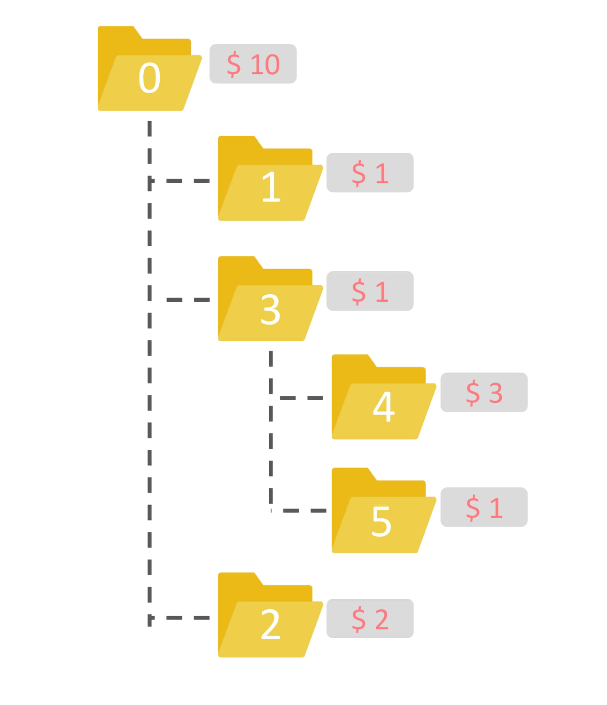

#

初選的題目說過，ub33用雲端硬碟分享了很多蘿莉照片給ub44，可是因為照片實在太多了，超過雲端硬碟所提供的免費額度。 （別傻了，雲端服務供應商才不會因為你提供一堆蘿莉照片而無限提供你免費空間呢）  
既然超過了免費額度，那就變成要收費了，收費分成兩個部分，一個是儲存空間的費用，這在本題不重要，我們不考慮，而另一個則是共用檔案的收費。  
是這樣的，每當你要共用一個檔案或資料夾，你需要付一些手續費，而根據資料夾的大小，檔案的大小，或資料夾內的檔案價值等，會收取不同的費用，反正服務供應商有他們的算法，按照他們要的價錢付就對了。  
ub33一樣想要將一些蘿莉照片跟ub44分享，而他這次希望他需要付的手續費越少越好，你能幫他算出要共用他想分享的那些檔案，他最少需要付多少手續費嗎?  

定義一個檔案或資料夾 A 被直接包含在某個資料夾 P 下，代表 A 的上一層資料夾是 P  
定義一個檔案或資料夾 A 被間接包含在某個資料夾 P 下，代表 A 的上 $x$ ($x>1$) 層資料夾是 P。
若共用一個資料夾 A ，被 A 直接包含與間接包含的所有資料夾與檔案也會被共用，但只要支付共用 A 資料夾的手續費即可。  

## 輸入
第一行兩個數字 $n$ $q$，代表總共有 $n$ 個檔案或資料夾，以及有$q$個檔案或資料夾要共用。  
第二行有 $n-1$ 個數字，代表每個檔案或資料夾的上一層是哪個資料夾，從編號 $1$ 的開始，因為編號 $0$ 是根資料夾。  
第三行有 $n$ 個數字 $p_i$，代表編號 $i$ ($0 \leq i \leq n-1$) 的資料夾或檔案共用需多少花費。  
第四行有 $q$ 個數字 $x_i$ 代表有那些編號的資料夾或檔案要共用。  

## 輸出
輸出一個數字，代表最少要多少手續費，才能共用所有ub33想共用的檔案。  

## 輸入限制
* $1 \leq n \leq 100000$
* $1 \leq q \leq n$
* $0 \leq p_i \leq 10^9$

## 子任務
| 編號 | 分數 | 限制 |
| --- | -------- | -------- |
|1|13|所有資料夾直接包含最多只有一個資料夾或檔案|
|2|27|直接包含超過一個資料夾或檔案的資料夾個數 $\leq18$，|
|||且所有要共用的都是直接包含大餘1個資料夾或檔案的資料夾|
|3|26|$n \leq 18$|
|4|34|無額外限制|

## 範例輸入
```
6 2
0 0 0 3 3
10 1 2 1 3 1
4 5
```
## 範例輸出
```
1
```
